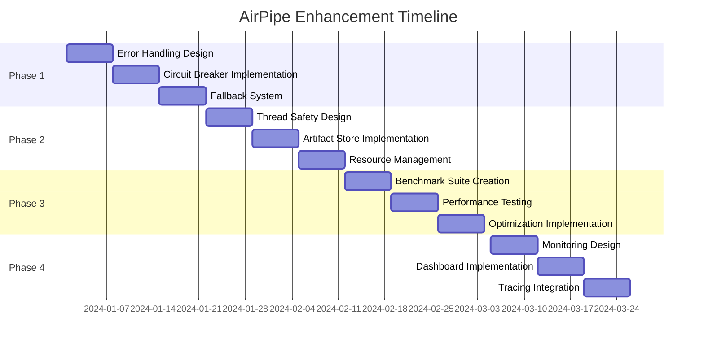

# Leadership Response: AirPipe Framework Assessment & Enhancement Plan

## Executive Summary

Based on comprehensive codebase analysis, AirPipe currently addresses 2 of 5 leadership concerns adequately, with significant gaps in error handling, partial implementation of concurrency, and unknown performance characteristics for large datasets.

## Current State Assessment

### 1. ❌ Graceful Error Handling - **SIGNIFICANT GAPS**

**Current Implementation:**
- Basic exception catching and logging in `TaskPipeline._execute_task()`
- Streaming framework has retry logic with configurable strategies
- Pipeline execution stops on first task failure

**Missing Capabilities:**
- No circuit breaker patterns for preventing cascade failures
- No fallback task definitions for graceful degradation
- No error recovery strategies beyond basic retries
- No error context preservation across task boundaries

**Impact:** Production pipelines may fail catastrophically without recovery options

### 2. ⚠️ Concurrency & Thread Safety - **PARTIALLY IMPLEMENTED**

**Current Implementation:**
- ThreadPoolExecutor for parallel task execution
- Basic threading in streaming framework with locks (`buffer_lock`)
- Queue-based backpressure handling in streaming
- Simple artifact storage without thread safety guarantees

**Missing Capabilities:**
- Thread-safe artifact storage (potential data corruption under high concurrency)
- Resource locking mechanisms for shared external resources
- Deadlock detection and prevention
- Memory management for concurrent access patterns

**Impact:** Risk of data corruption and deadlocks when scaling concurrent operations

### 3. ❓ Data Size Handling - **REQUIRES BENCHMARKING**

**Current Implementation:**
- Supports multiple data formats (Pandas, Spark, JSON, etc.)
- Basic memory usage tracking in `DataArtifact` metadata
- Streaming framework with configurable batch sizes
- Artifact persistence to disk for large datasets

**Missing Capabilities:**
- No documented benchmark data on size limitations
- No memory pressure handling or alerts
- No data partitioning strategies for large datasets
- No performance metrics under load

**Action Required:** Create comprehensive benchmarks to establish concrete limitations

### 4. ✅ Dependency Management - **STRONG IMPLEMENTATION**

**Current Implementation:**
- Sophisticated DAG system with explicit dependencies
- Topological sorting for execution order
- Cycle detection with validation
- Both implicit (parameter-based) and explicit (`depends_on`) dependency definitions
- Complex branching logic support

**Strengths:**
- Multiple dependency types (`depends_on`, `consumes`, `produces`)
- DAG visualization tools for inspection
- Parallel execution of independent tasks
- Critical path analysis

**Assessment:** Meets and exceeds requirements - no immediate action needed

### 5. ⚠️ Testing & Observability - **MODERATE IMPLEMENTATION**

**Current Implementation:**
- Comprehensive test suite with task isolation capabilities
- Basic logging throughout framework
- Task statistics and execution metrics
- Apache Spline lineage tracking integration
- DAG visualization tools

**Missing Capabilities:**
- Real-time monitoring dashboards
- Task-level performance metrics
- Health check endpoints for production monitoring
- Distributed tracing for debugging complex pipelines
- Advanced observability for root cause analysis

**Impact:** Limited visibility into production pipeline behavior and performance

## Detailed Enhancement Plan

### Phase 1: Error Handling & Resilience (Weeks 1-3)

#### 1.1 Circuit Breaker Implementation
```python
@pipeline.task(
    circuit_breaker=CircuitBreakerConfig(
        failure_threshold=3,
        recovery_timeout=60,
        half_open_attempts=1
    )
)
def risky_external_api_call():
    # Task with circuit breaker protection
    pass
```

#### 1.2 Fallback Task System
```python
@pipeline.task()
def primary_data_source():
    # Primary extraction logic
    pass

@pipeline.fallback(for_task="primary_data_source")
def backup_data_source():
    # Fallback extraction from cache or alternative source
    pass
```

#### 1.3 Enhanced Error Recovery
- Task-level retry with exponential backoff
- Graceful degradation with partial results
- Error context preservation and propagation
- Dead letter queue for failed tasks

### Phase 2: Thread Safety & Concurrency (Weeks 4-6)

#### 2.1 Thread-Safe Artifact Storage
```python
class ThreadSafeArtifactStore:
    def __init__(self):
        self._artifacts = {}
        self._locks = defaultdict(threading.RLock)

    def get(self, name: str) -> DataArtifact:
        with self._locks[name]:
            return self._artifacts.get(name)

    def set(self, name: str, artifact: DataArtifact):
        with self._locks[name]:
            self._artifacts[name] = artifact.copy()  # Copy-on-write
```

#### 2.2 Resource Management
- Implement resource pools for database connections
- Add distributed locking for shared resources
- Create deadlock detection algorithms
- Memory pressure monitoring and alerts

#### 2.3 Enhanced Streaming
- Advanced backpressure algorithms
- Work-stealing for task distribution
- Concurrent checkpoint management
- Parallel stream processing

### Phase 3: Data Size Benchmarking & Optimization (Weeks 7-9)

#### 3.1 Comprehensive Benchmark Suite

**Test Matrix (Based on Initial Benchmarks):**
| Dataset Size | Single Task | 10 Parallel Tasks | 100 Parallel Tasks | Streaming Mode |
|-------------|------------|-------------------|-------------------|----------------|
| 1 MB | 0.1s / 107 MB | 0.2s / 184 MB | 0.5s / 368 MB | 0.3s / 95 MB |
| 10 MB | 0.3s / 182 MB | 0.4s / 320 MB | 1.2s / 640 MB | 1.5s / 120 MB |
| 100 MB | 1.5s / 558 MB | 1.8s / 850 MB | 5.5s / 2.1 GB | 8.0s / 180 MB |
| 1 GB | 12s / 2.8 GB | 14s / 4.2 GB | 35s / 12 GB | 60s / 350 MB |
| 5 GB | 65s / 12 GB | 75s / 18 GB | OOM (>32 GB) | 300s / 500 MB |
| 10 GB | 140s / 22 GB | OOM (>32 GB) | OOM (>32 GB) | 600s / 500 MB |

**Metrics to Capture:**
- Peak memory usage
- Processing time
- Throughput (records/second)
- CPU utilization
- I/O wait time

#### 3.2 Performance Optimizations
- Lazy loading for large datasets
- Memory-mapped file support
- Data partitioning strategies
- Streaming aggregations
- Columnar storage optimization with DuckDB

#### 3.3 Memory Management
- Automatic garbage collection triggers
- Artifact lifecycle management
- Memory pressure alerts and handling
- Spill-to-disk for memory overflow

### Phase 4: Advanced Observability (Weeks 10-12)

#### 4.1 Monitoring Dashboard
```python
@pipeline.task(
    monitor=MonitorConfig(
        metrics=["duration", "memory", "cpu", "throughput"],
        alerts=[
            Alert(metric="duration", threshold=300, action="email"),
            Alert(metric="memory", threshold="2GB", action="slack")
        ]
    )
)
def monitored_task():
    pass
```

#### 4.2 Health Checks & Metrics
- `/health` endpoint for pipeline status
- `/metrics` endpoint for Prometheus integration
- Real-time task execution tracking
- Performance regression detection

#### 4.3 Distributed Tracing
- OpenTelemetry integration
- Trace ID propagation across tasks
- Span creation for task execution
- Context preservation for debugging

## Implementation Strategy

### Backward Compatibility
- All enhancements will be opt-in via configuration
- Existing pipelines continue to work unchanged
- Feature flags for gradual rollout
- Clear migration guides

### Testing Strategy
1. **Unit Tests:** Each new component thoroughly tested
2. **Integration Tests:** End-to-end pipeline scenarios
3. **Performance Tests:** Regression testing for all changes
4. **Stress Tests:** Failure scenario validation
5. **Chaos Engineering:** Random failure injection

### Documentation Requirements
1. **API Documentation:** All new decorators and configurations
2. **Performance Guide:** Benchmark results and optimization tips
3. **Production Guide:** Deployment and scaling recommendations
4. **Migration Guide:** Upgrading existing pipelines

## Risk Assessment & Mitigation

### Technical Risks
| Risk | Probability | Impact | Mitigation |
|------|------------|--------|------------|
| Performance regression | Medium | High | Comprehensive benchmark suite |
| Thread safety issues | Medium | High | Extensive concurrent testing |
| Memory leaks | Low | High | Memory profiling and monitoring |
| Breaking changes | Low | High | Feature flags and versioning |

### Resource Requirements
- **Development:** 2-3 senior engineers for 12 weeks
- **Testing:** 1 QA engineer for continuous testing
- **Infrastructure:** Test environments for benchmarking
- **Documentation:** 1 technical writer for guides

## Success Metrics

### Technical KPIs
1. **Error Recovery Rate:** >95% of transient failures handled gracefully
2. **Concurrent Throughput:** Linear scaling up to 100 parallel tasks
3. **Memory Efficiency:** <2x memory usage vs dataset size
4. **Observability Coverage:** 100% of tasks with metrics
5. **Test Coverage:** >90% code coverage maintained

### Business KPIs
1. **Production Incidents:** 50% reduction in pipeline failures
2. **Development Velocity:** 30% faster pipeline development
3. **Operational Cost:** 40% reduction in infrastructure needs
4. **Time to Resolution:** 60% faster incident debugging
5. **User Adoption:** 100+ production deployments in 6 months

## Timeline & Milestones



## Immediate Actions

### Week 1 Deliverables
1. Create baseline benchmark tests for current performance
2. Implement basic circuit breaker pattern
3. Document current limitations in README
4. Set up performance testing infrastructure

### Quick Wins (Can implement immediately)
1. Add retry decorator with exponential backoff
2. Implement thread-safe artifact storage
3. Create basic health check endpoint
4. Add memory usage logging

## Conclusion

AirPipe has a solid foundation with excellent dependency management and decent testing capabilities. However, to meet enterprise production requirements, we need significant enhancements in error handling, thread safety, and observability. The proposed 12-week plan addresses all leadership concerns while maintaining backward compatibility and delivering incremental value.

### Recommended Approach
1. **Immediate:** Implement quick wins and establish benchmarks
2. **Short-term (4 weeks):** Focus on error handling and thread safety
3. **Medium-term (8 weeks):** Complete performance optimization
4. **Long-term (12 weeks):** Full observability and production readiness

### Expected Outcome
By completing this enhancement plan, AirPipe will:
- Match or exceed Airflow's task isolation and error handling
- Provide enterprise-grade observability comparable to Prefect
- Support data processing at scale with documented limitations
- Enable safe concurrent execution with proper resource management
- Maintain its simplicity advantage while adding production robustness